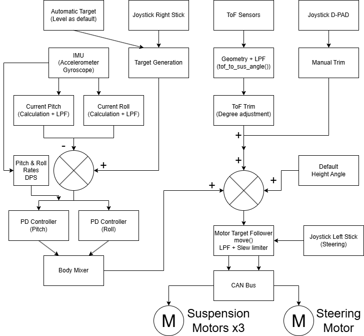
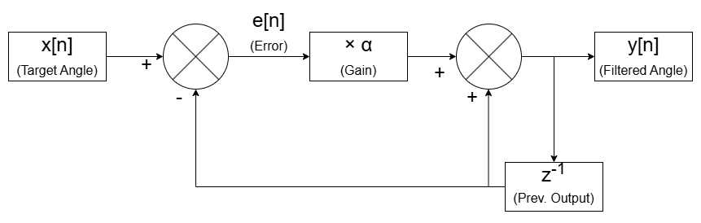

# Predictive Rover Suspension
## Final Year Project Code Description
TOF and IMU sensors are utilised to assess the terrain and the rover's body pose  
respectively. A central controller communicates over CAN bus to command slave  
motor controllers executing field-oriented control to operate BLDC motors.  
These motors are used for suspension and body control. <br><br>
Any mention of the word ***'custom'*** below, means that it was coded for  this  
project specifically. Not acquired. Treat as created code.

The ```/src/``` directory holds the core applications of the project.<br>

## Simplified High-Level Overview


## /src/main.py
```/src/main.py``` contains the primary loop that runs the rover.<br>
**There are several references to wheel motors throughout main.py which have**  
**been commented out until the wheel motors are up and running again.**  
The program starts by initialising the CAN bus, joystick, ToF sensors and IMU  
sensor. Then constants and variables are declared for attitude targets,  
proportional differential control, PD output clamp limits, low-pass filter.  
Constants are declared for steering and velocity. Trim parameters are declared.  
The individual slave motor controllers are initialised as objects using  
subclasses from ```MITMotor``` in ```mit_motors.py```. Then, the motor startup  
sequence is commenced by sending unique CAN commands to each motor controller.  
<br>
Next, a *'waiting lobby'* is created to wait for user input - the triangle  
button on the hand controller. When the button is pressed, the suspension motors  
are sent default angle values to stand up the rover. When the rover is upright,  
the ToF sensors are calibrated to the expected values from known geometry using  
the ```tof_offset()``` function from the ```angle_height_calc``` custom module.  
A frequency of 100Hz is set for the main loop ( ```dt = 0.01``` ) .

The **main application while loop** polls the tof sensors. Only one sensor is  
polled for every 4th alternate loop, due to performance issues observed if all  
get polled at the same time.  
The IMU data is collected and pitch/roll values are calculated using formulae  
described in presentation (aeropspace XYZ sequence). They are then filtered  
using a first order low-pass filter.

Joystick events are polled.  
The right-stick analogue XY axes are used to alter the pitch and roll targets of  
the pitch and roll PD loops.
The left-stick analogue X axis is used for steering.  
The L2 and R2 analogue triggers are combined into a single normalised, signed  
axis for controlling wheel velocity (RPM), but inactive due to motor issues.  
The D-PAD left/right/down buttons adjust the manual trim values of the  
individual suspension angles. The D-PAD buttons can be held down for continuous  
adjustment.  
The D-PAD up button is to reset the trim values to 0.  
The D-PAD up button while the options button is held sets the rover to standby  
mode, where the suspesion angle is set to -90 degrees, drawing negligible  
current.
The cross button (X) lies the rover fully down.  
The triangle button stands the rover fully up.  
Automatic trim from the ToF sensors (per limb) is enabled/disabled by pressing  
the R1 button (debounce applied).  
The 'create' button exits the program and safely shuts down the rover.

The pitch and roll target are calculated. If no joystick input or payload  
protection (future intent), then the targets are just zero.  
Zero target means a level rover body with respect to gravity.

Next are separate PD loops for pitch and roll. Clamps are applied to avoid  
undesireable responses and a low-pass filter is applied for smooth transitions.

The outputs of the pitch and roll PD loops are fed into ```mix_body_degrees()```  
to determine the required outputs for a three-limbed system.

Then, three summing junctions (one for each limb) take the ```SUS_READY_DEG```  
(-70 degrees), the relative adjustment outputs of ```mix_body_degrees()```, the  
automatic ToF trim, and the manual trim.

The final step of the main loop is to send the output of the summing junctions  
to the motors using the ```move()``` method.

When anything causes an exception of exit request, the ```finally``` clause  
ensures a safe motor shutdown before the program exits.

## /src/mit_motors.py
This custom module provides the core functional link to all the motor  
controllers. Objects are created using one of the individual sub-classes  
specific to each motor type to account for their differences, but they all  
inherit the attributes and methods of the MITMotor base class because they share  
the same MIT-style packed CAN frame. The ```command_position_deg()``` method is  
the final link between this application and the actuation of each motor. Each  
command is limited to a 5 degree change to avoid rogue requests. The entire  
application is intended to send a steady stream at 100 Hz, not individual large  
commands. ```command_position_deg()``` is never called externally. Instead, the  
```move()``` method is called, which incorporates a target follower for fluid  
transitions and a clamp to limit out-of-range requests. 



## /src/angle_height_calc.py
This hosts the geometry constants of the:
- Origin
- Suspension radius
- Wheel radius
- Default suspension angle
- ToF sensor radius from origin
- ToF angle

It calculates the constants of:
- ToF sensor cartesian coordinates
- ToF unit vector (direction)
- Ideal distance from ToF to ground plane intersection

The module has two functions:
- Pass in ```measured_distance```, returns ```offset``` for calibration
- Pass in ```cal_measured_distance```, returns ```angle_deg``` for suspension

## /src/tof.py
```/src/tof.py``` binds the required Python functions to the <br>
```/tof_driver/libvl53l4cd.so``` shared library using the ```ctypes```<br> 
standard module. <br>
It hosts the ```TofSensor``` class for creating each sensor as an object, <br>
each with their own methods for polling, changing I2C address, etc...

## /src/joystick.py
This is custom module that maps the buttons and axes of the PS5 game controller  
to friendly names for easier programming. This includes a ```deadzone()```  
function to reject tiny input values. It also hosts functions for normalising  
the analogue triggers, and combining those triggers into a single foward/reverse  
axis.

## /src/helpers.py
Two simple functions:
- ```run_cmd()``` to simplify Linux shell commands as list of strings.
- ```clamp()``` is a generic clamp function to limit within upper & lower limits  

## /src/steer_vel_mixer.py
Prototype module intended to implemenent the steering formulae from section  
2.7.5 of the literature review, but adapted for a three-wheel-drive system, and  
account for leaning geometry and the articulated steering motor angle, similar  
to the ```curve_left```/```curve_right``` attributes from earlier differential  
steering tests: ```tests/010-test-ps3-curve.py```.  
Inspiration from ```CamJamKitRobot``` Python module.  
This relied on working wheels, so unfinished due to FOC, 6-step, and elec fault.

## /tof_driver/platform.c
```/tof_driver/platform.c``` was created to use the ST VL53L4CD driver.<br>
It links Linux I2C functionality to the specific API handles for reading and<br>
writing to the sensor's registers. This was a challenge.<br>
*The remaining files in* ```/tof_driver/``` *are the actual driver downloaded*  
*from ST. A pdf guide to the driver is in that folder.*

## /daemons/can0_enable.py
Used as a Linux startup service to ensure GPIO(line 43) and can0 are enable  
when the system starts. Simplifies the main application.  
A README file within the directory describes how to implement this.

## /daemons/xshut_startup.py
Used as a Linux startup service to ensure SPI commands are sent to the shift  
register when the system boots to ensure all outputs are low. This reduces risk  
of misfiring the address changes on the ToF sensors.  
A README file within the directory describes how to implement this.

## /stm32_embedded_c/app.c
Embedded C program on the ST B-G431B-ESC1 slave motor controller.  
The ```app_loop()``` function is called from the main ```while()``` loop in  
```main.c```. The purpose of the ```app_loop()``` in this file is to act as an  
intermediary API between ```main.c``` and the MCSDK API from ST.  
The ```target_speed``` as ```cmd``` is the primary parameter passed in to this  
motor controller board as the first two bytes of the addressed CAN frame. This  
program then navigates all the necessary conditions of implementing variable  
speed and direction. The key components created in this program are the  
```soft_stop_init()``` function which feeds the *'Soft-Stop Catcher'* if/else  
statements. Much of the rest of the code involves setting and releasing flags,  
checking status and issuing speed/ramp commands to the MCSDK API.  
The MCSDK API itself only handles PWM timers and reports runtime and fault  
states.  
This is an overly complicated way to implement six-step three-phase motor  
control for an application that it's not suited for (precise, smooth low-speed  
positioning). Future intent: Discard code entirely and combine Simple FOC  
(opensource library) with ST MC Workbench (for CAN, timer, ADC, and GPIO setup).

## /stm32_embedded_c/main.c
Automatically generated from ST CubeMX with additional user code.
#### USER CODE BEGIN PD
#defines for CAN TX/RX addresses and maximum speed (RPM).  
These addressed need to be different for each motor.

#### USER CODE BEGIN 2
Defines the CAN filter and initialises configuation for STM32G4 series chips.  
Followed example from ST community forums. Link in code.

#### USER CODE BEGIN 4
Two functions.
- The first is a CAN RX handler to give ```target_speed``` to app_loop() through  
includes in ```app.h``` , namely ```extern int16_t target_speed;```. This  
function also calls the 2nd function, ```send_feedback_frame()```.
- ```send_feedback_frame()``` sends a CAN message declaring actual BEMF-derived  
speed from API, the measured supply voltage, 6-step duty cycle as a current  
proxy, and direction.  
The behaviour here matches the MIT-style behaviour by sending reply for every  
command received.

#### USER CODE BEGIN WHILE
```main.c``` while loop calling ```app_loop()``` from ```app.c``` continuously.

## /tools/
Probably not worth reviewing.  
Many taken from web examples, poorly commented. This directory can be deleted  
with no affect on the main application.  
This directory contains a collection of adhoc tools useful for development, such  
as flashing a new zero-point for a motor controller's ROM, or observing joystick  
inputs, or changing I2C addresses. 

## /tests/
Poorly commented. Can be deleted without affecting main application.  
Similar to tools, but less organised. It just shows iterative testing of  
concepts, components, and libraries, throughout the project development.

## /docs/
Poorly organised. Can be deleted without affecting main application.  
A collection of *README_xxx.md* variations as personal notes to refer to for  
setups and Linux commands.
