# Predictive Rover Suspension
Final year project. Using TOF and IMU sensors to assess terrain and body pose respectively, to control BLDC motors using FOC controllers and CAN communication for suspension and body control.
## Python Versions
Don't assume the newest version is the most appropriate.
On Jetson Orin Nano the Python version is 3.10.12 (!!! **Do NOT upgrade** !!!)
<br>
[Notes for ROS2 Humble on Ubuntu 22.04](https://ros2-tutorial.readthedocs.io/en/humble/preamble/python/installing_python.html?)
<br>

## Generic Instructions for Python Project with VS Code and GitHub
<details>
<summary>If the destination of the target machine is generic Linux, ensure PIP and Venv are installed there first. <br>Click to expand.</summary>

```bash
python3 --version
```
```bash
python3 -m pip --version
```
```bash
python3 -m venv --help
```
If they need to be installed:
```bash
sudo apt update
```
```bash
sudo apt install -y python3-pip python3-venv
```

### For newer versions of Ubuntu you need to add the ```Deadsnakes``` apt repo for older Python versions.

```bash
sudo add-apt-repository ppa:deadsnakes/ppa
```
```bash
sudo apt update
```
```bash
sudo apt install -y python3.10 python3.10-venv python3.10-dev python3.10-pip
```

### For very new versions of Ubuntu you need to use ```pyenv``` to install older versions of Python.
Install build deps (once)
```bash
sudo apt install -y \
  build-essential \
  libssl-dev zlib1g-dev libbz2-dev \
  libreadline-dev libsqlite3-dev \
  libncursesw5-dev xz-utils tk-dev \
  libxml2-dev libxmlsec1-dev libffi-dev liblzma-dev
```
Install ```pyenv```
```bash
curl https://pyenv.run | bash
```
Add to ```~/.bashrc```:
```bash
export PYENV_ROOT="$HOME/.pyenv"
export PATH="$PYENV_ROOT/bin:$PATH"
eval "$(pyenv init -)"
```
Reload:
```bash
exec "$SHELL"
```
Install Python 3.10
```bash
pyenv install 3.10.14
```
Use it only in this project:
```bash
cd ~/code/camjam-3-normal
```
```bash
pyenv local 3.10.14
```
```bash
python -m venv .venv
```
```bash
source .venv/bin/activate
```
Verify:
```bash
python --version
```
---


</details>
<br>
Create new repo on GitHub.

In VS Code go to Command Palette `Ctrl + Shift + P` (assumes Remote Repositories extension is installed).  

Search for '*Remote Repositories: Open Remote Repository*'  
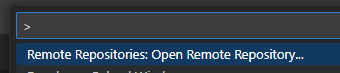

Then, choose '*Open Repository from GitHub*'  
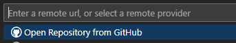

Within the remote repo click on the lower-left GitHub symbol (VS Code UI) .

Then select '*Continue working in New Local Clone*'  
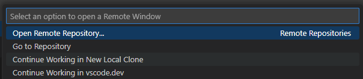

Then choose overall local folder. A new repo folder will be created within this with the repo name.  


Create folder for storing README images.
```bash
mkdir -p docs/images
```

Create a `src` folder for project code.
```bash
mkdir src
```

Create .gitignore file.  
```bash
code .gitignore
```

.gitignore contents
```
.venv/
__pycache__/
*.pyc
.pytest_cache/
.mypy_cache/
```
### Create a virtual environment.
In *Terminal*, navigate to repo folder, then create the venv with this command:  
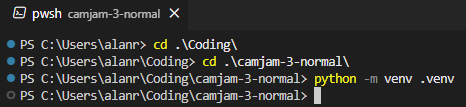
```
python -m venv .venv
```
You may need to close and reopen to sync the changes, so that the `.venv/` folder appears.  

Right-click in repo and click '*Open in Integrated Terminal*'.
Activate the venv:<br>
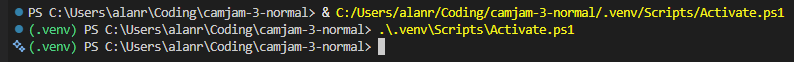 
Powershell:
```bash
.\.venv\Scripts\Activate.ps1
```
or BASH:
```bash
source .venv/Scripts/activate
```
or Linux:
```bash
source .venv/bin/activate
```

If you need to deactivate (optional):
```bash
deactivate
```

### VS Code: pick the interpreter once
```Ctrl + Shift + P``` → Python: Select Interpreter → choose ```.venv```  
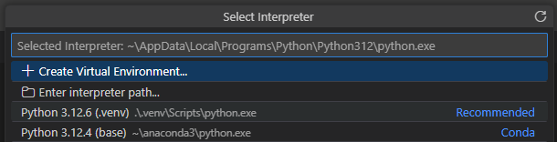

<details>
<summary>
If you need to change the interpreter for a specific version, click here to expand.
</summary>

Deactivate current virtual environment:
```bash
deactivate
```
Remove the venv entirely (disposable):
```bash
rm -rf .venv/
```
Use a specific installed interpreter version using Python Launcher, `py`.
```bash
py -3.10 -m venv .venv
```
</details>

### Automatically activate venv and BASH within repo on VS Code:
1. Create VS Code settings JSON file within repo:  
```bash
mkdir .vscode\
```
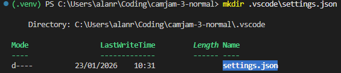

```bash
code .vscode\settings.json
```

2. Contents of .vscode\settings.json  
```json
{
  // Activate .venv/ when terminal is started
  "python.terminal.activateEnvironment": true,

  // Work with Bash as the default terminal
  "terminal.integrated.defaultProfile.windows": "Git Bash",
  "terminal.integrated.defaultProfile.linux": "bash",
  "terminal.integrated.defaultProfile.osx": "bash"
}
```

3. Close all open terminals and close VS Code fully.
4. Start VS Code and open new one `Ctrl + Shift + '`

### Check if runnig in venv:
```
python -m pip -V
```

### Initial `requirements.txt` file:
The contents should be initially empty if contained within `.venv/`.
```bash
pip freeze > requirements.txt
```
Install the captured dependencies on the new machine:
```bash
pip install -r requirements.txt
```
### Create `.vscode/extensions.json` file for recommending VS Code Extensions for this project.
```bash
code .vscode/extensions.json
```
You can get IDs of installed extensions using:
```bash
code --list-extensions
```
The `extensions.json` contents look like:
```json
{
"recommendations": [
"ms-python.python",
"ms-python.vscode-pylance",
"ms-vscode.remote-explorer"
],
"unwantedRecommendations": []
}
```
When repo accessed on new machine a prompt should show extension recommendations.

## To Migrate to New Machine with VS Code
### On old machine:
1. Capture required dependencies
```bash
pip freeze > requirements.txt
```
2. Sync project with GitHub

### On new machine:
3. Open remote repository and continue to work in local clone
4. Create and activate virtual environment:
```bash
python3 -m venv .venv
```
```bash
source .venv/bin/activate
```
5. Install dependencies:
```bash
pip install -r requirements.txt
```
## Connect to Pi over SSH
[YouTube example here.](https://www.youtube.com/watch?v=MzBFo65xnbA&list=PLBrq1OKRHMwUbbujTlmt1YGRzL9O0LfNJ&index=5)

Use `Remote Explorer` extension  .

Click the cog:<br>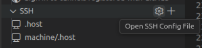

Click your default config file:<br>

Example host entry:
```
Host CamJam_RPi_Zero_2W
    HostName 192.168.1.190
    User alan
```

A link should appear on the left:<br><br>
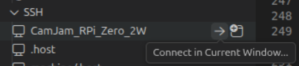

Enter your SSH password, then VSS Code remote server will be downloaded to the device. You will know you're connected by looking at the lower-left status:<br><br>
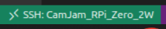

You can then perform normal SSH activities, as seen here:<br><br>
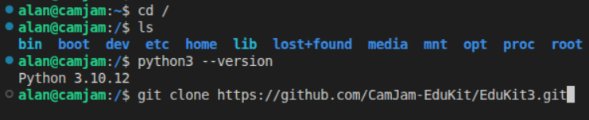

Create or clone a repo (SSH session on remote machine):
```bash
git clone https://github.com/CamJam-EduKit/EduKit3.git
```

Navigate to the repo folder and open in VS Code in using mouse or in Terminal:
```bash
cd EduKit3/
```
```bash
code -r .
```
(Doesn't seem to work in normal Terminal. Needs to be VS Code Terminal)

You should now be in a remote VS Code session with the repo displayed like it's a local.<br>
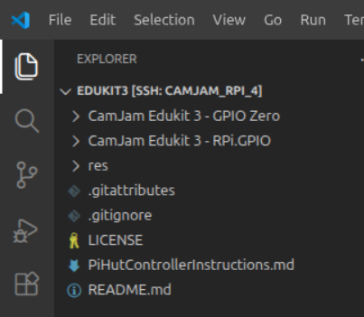

### To edit root files within VS Code Remote Explorer

Create an file to point to VS Code Server:
```bash
sudo tee /usr/local/bin/code-wait >/dev/null <<'EOF'
#!/bin/sh
CODE="$(ls -1t "$HOME"/.vscode-server/cli/servers/*/server/bin/remote-cli/code 2>/dev/null | head -n1)"
[ -x "$CODE" ] || { echo "VS Code Remote CLI not found under ~/.vscode-server." >&2; exit 1; }
exec "$CODE" --wait "$@"
EOF
```
Make it executable:
```bash
sudo chmod +x /usr/local/bin/code-wait
```
Append `.bashrc` to have `sudoedit` command with this line:
```bash
echo 'export SUDO_EDITOR="/usr/local/bin/code-wait"' >> ~/.bashrc
```
Examples:
Open root files to edit within VS Code Remote:  
(instead of sudo nano)
```bash
sudoedit /boot/firmware/config.txt
```
Edit normal user files:
```bash
code -r ~/.bashrc
```
<br>
<br>

## Best GPIO Setup for Linux for Broader Futureproof Development:
Use `libgpiod` as a C library to interface with `/dev/gpiochip*`:  
(Usually already installed in distro)<br>
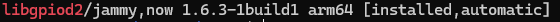

The `gpiozero` Python wrapper can use `libgpiod` underneath (On Raspberry Pi OS by default).


### GPIOZERO on Ubuntu

If running Ubuntu, then the appropriate libraries will need to be added:<br>
(note: RPi-GPIO is legacy. Not needed)
```bash
sudo apt install python3-gpiozero
sudo apt install python3-RPi.GPIO
```
[(Library installation notes)](https://gpiozero.readthedocs.io/en/stable/installing.html)<br>
or, alteratively (more legacy):
```bash
sudo apt install python3-lgpio
```
[Guide to run Raspberry Pi GPIO library in Ubuntu](https://ubuntu.com/tutorials/gpio-on-raspberry-pi)

### If there is a 'GPIO Busy' error, then often the SPI GPIO is enabled in Ubuntu.
Fix by editing the config file:
```bash
sudoedit /boot/firmware/config.txt
```
Then, change the `dtparam=spi` value:
```diff
-dtparam=spi=on
+dtparam=spi=off
```

### Pin Factories
GPIOZERO is a python wrapper that uses various underpinnings (pin factories).<br>
When first run, we can probe to see what it uses:
```python
from gpiozero import LED, Device
led = LED(17)          # or any GPIO number
print(Device.pin_factory) # Show what GPIOZERO selects lgpio, gpiod(native), etc
led.close()
```
Output (shows `lgpio` was used):
```bash
alan@edukit3:~/source/repos/camjam-3-normal/tests$ python3 gpiozero_pin_factory_probe.py 
<gpiozero.pins.lgpio.LGPIOFactory object at 0xffffbe0dccd0>
```
The most platform agnostic modern pin factory is `libgpiod`, but it only supports GPIO and not the alternative funcions of the pins such as PWM. This would need an extra layer.<br>
See [README_PWM_GPIOD.md](README_PWM_GPIOD.md)<br>
`CamJamKitRobot` uses `Robot`, `Motor`, and `PWMOutputDevice` classes. This implementation of PWM is software-defined, so it uses just the GPIO on/off portion of the pins (repeatedly in software), not the actual PWM controllers. Harware PWM is not available on the pins that the CamJam HAT is wired to, so `lgpio` is used.

<details>
<summary>Inspect the code from CamJam (source of the class) - Click to expand:</summary>

(`python3 -c` in bash passes a string in as a python program)
```bash
python3 -c "import inspect; from gpiozero.boards import CamJamKitRobot; print(inspect.getsource(CamJamKitRobot))"
```
Inspect signature and docstring:<br>
(which arguments are accepted)
```bash
python3 -c "import inspect; from gpiozero.boards import CamJamKitRobot; print(inspect.signature(CamJamKitRobot.__init__)); print(CamJamKitRobot.__doc__)"
```
To show that the `robot`class is based on a 'generic dual-motor' with (forward, back) tuples for each of the left and right motors:
```bash
python3 -c "import inspect; from gpiozero import Robot; print(inspect.getsource(Robot))"
```
☝️ The curve components are interesting.<br>
From inspection we see that the gpiozero `Robot` class uses the `motor`class
```bash
python3 -c "import inspect; from gpiozero import Motor; print(inspect.getsource(Motor))"
```
To inspect the `PWMOutputDevice` class (software PWM):
```bash
python3 -c "import inspect; from gpiozero.output_devices import PWMOutputDevice; print(inspect.getsource(PWMOutputDevice))"
```
</details>

---
### Enable I2C
Open the `config.txt` file for Ubuntu's settings:
```bash
sudoedit /boot/firmware/config.txt
```
Look for `dtparam=i2c_arm=on`. You may need to adjust and reboot.
Then, scan the bus using `i2c-tools`.
```bash
sudo apt update
sudo apt install i2c-tools
```
Check the I2C buses available:
```bash
ls /dev/i2c*
```
Response like: `/dev/i2c-1`
Then scan I2C bus 1:
```bash
$ i2cdetect -y 1
```
Below is the response, showing 0x29 on the bus:
```bash
     0  1  2  3  4  5  6  7  8  9  a  b  c  d  e  f  
00:                         -- -- -- -- -- -- -- --  
10: -- -- -- -- -- -- -- -- -- -- -- -- -- -- -- --  
20: -- -- -- -- -- -- -- -- -- 29 -- -- -- -- -- --  
30: -- -- -- -- -- -- -- -- -- -- -- -- -- -- -- --  
40: -- -- -- -- -- -- -- -- -- -- -- -- -- -- -- --  
50: -- -- -- -- -- -- -- -- -- -- -- -- -- -- -- --  
60: -- -- -- -- -- -- -- -- -- -- -- -- -- -- -- --  
70: -- -- -- -- -- -- -- --    
```
---
### CircuitPython within normal Python:
[Adafruit.com](https://learn.adafruit.com/circuitpython-on-raspberrypi-linux/running-circuitpython-code-without-circuitpython)<br>
[PyPi.org](https://pypi.org/project/Adafruit-Blinka/)<br>
Install Adafruit-Blinka within virtual environment:
```bash
pip3 install Adafruit-Blinka
```
Then, additional supports can be installed:<br>
[Documentation](https://learn.adafruit.com/adafruit-vl53l4cd-time-of-flight-distance-sensor/python-circuitpython)
```bash
pip3 install adafruit-circuitpython-vl53l4cd
```
Examples: [GitHub](https://github.com/adafruit/Adafruit_CircuitPython_VL53L4CD/tree/main/examples)

---
### Enable SPI (Can't be used alongside CamJam motor connection - Same physical pins)
Re-enable SPI after the earlier CamJam disable.
```bash
sudoedit /boot/firmware/config.txt
```
```diff
-dtparam=spi=off
+dtparam=spi=on
```
Then reboot and confirm SPI devices are available:
```bash
ls /dev/spi*

Response:
/dev/spidev0.0  /dev/spidev0.1
```
(☝️Note: The .0 and .1 refer to CE0 and CE1 chip enable pins)
<details>
<summary>
Alternatively use Adafruit CircuitPython on Raspberry PI:
</summary>

```bash
pip3 install adafruit-extended-bus
```
</details><br>

The SPIdev library should be already on the system's Python:
```bash
sudo apt list --installed | grep python3-spi

Response:
python3-spidev/jammy,now 3.5-3build1 arm64 [installed,automatic]
```
(The `spidev` library fits between Python or C and the Linux SPI driver).


<br>
<br>


