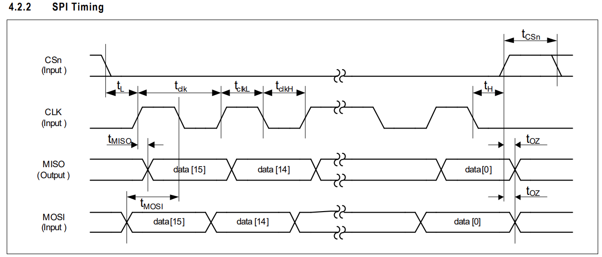

# Using the `spidev` Library in Python
## 1. Creating an SPI connection
[YouTube](https://www.youtube.com/watch?v=ZFG_g7IbNtw)
```python
import spidev

spi = spidev.SpiDev()
spi.open(0, 0)
```
| Code | Meaning |
| :--- | :--- |
| 0 | SPI bus 0 |
| 0 | CE0 chip select |

spi.open(0,0)  → /dev/spidev0.1 (CE0)

## 2. SPI device configuration
[Example device manual, 'AMS AS5048A'](https://ozrobotics.com/wp-content/uploads/2024/05/AS5048A-and-AS5048BEncoder-Datasheet-for-CubeMars-GL35-KV100-BLDC-Gimbal-Motor.pdf)<br>



### CPOL
The CS is 'active low'. See the timing diagram in the the example linked above (4.2.2 SPI Timing). When CSn goes low (CE0 on RPi).
We can see that slave's idle condition, when CS is high, that CLK is low.
This means `CPOL = 0`. 
| CPOL | Meaning |
| :--- | :--- |
| 0 | Slave's CLK is `low` when CS is high (Idle condition) |
| 1 | Slave's CLK is `high` when CS is high (Idle condition) |

### CPHA (Data Sampling Edge)
On the same timing diagram, we can see that the MISO data (from slave to master) changes bit position on the rising edge of CLK (from bit 15 to bit 14, etc...), but is ultimately read by the master on the falling edge of CLK (when the data is stable).
This means `CPHA = 1`. 
| CPHA | Sampling Edge (CPOL = 0) |
| :--- | :--- |
| 0 | Rising edge |
| 1 | Falling edge |

To decide the correct mode ( from slave's perspective ):

| Mode |  Mode (binary)| CPOL | CPHA | Idle | Sample  |
| ---- | ---- | ---- | ---- | ---- | ------- |
| 0    | 0b00 | 0    | 0    | Low  | Rising  |
| 1    | 0b01 | 0    | 1    | Low  | Falling |
| 2    | 0b10 | 1    | 0    | High | Falling |
| 3    | 0b11 | 1    | 1    | High | Rising  |

So, in the case above, we select Mode = 1, or 0b01 (same thing).

### Speed
From data sheet under SPI Interface 4.2 we can see `T`<sub>`CLK`</sub> (Serial clock period) is minimum 100ns from table 7. Min 100ns period is the same as saying Max 10MHz.
1MHz is a safe bet.
```python
spi.max_speed_hz = 1_000_000
```

